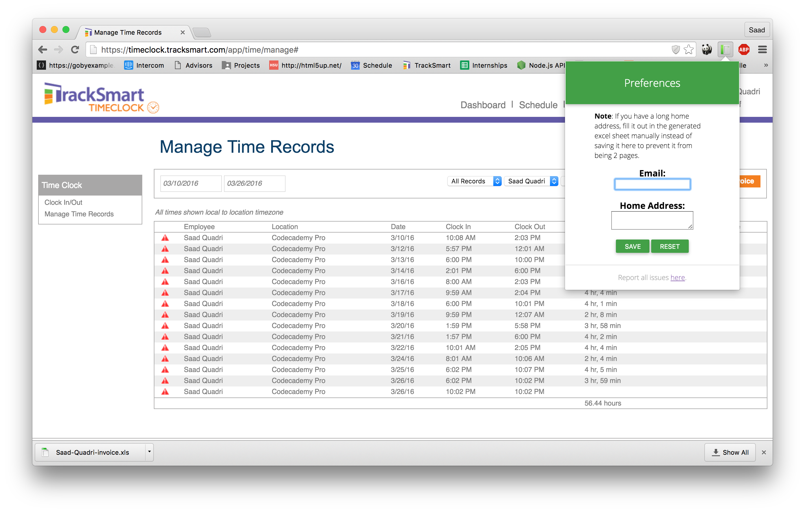
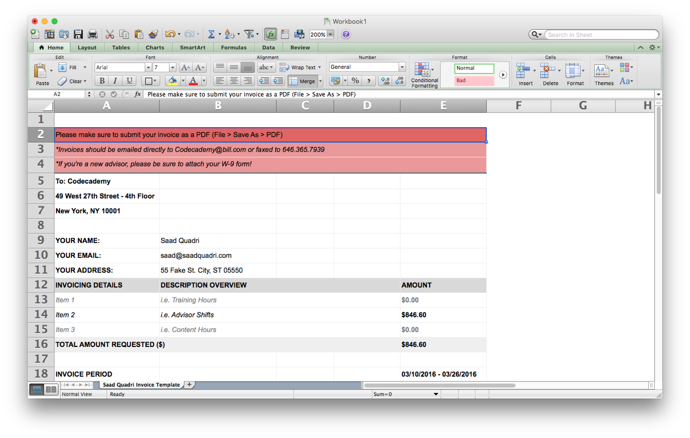

# cc-invoice
> A chrome extension that automatically generates an invoice for Codecademy Advisors.

## Usage
After installing the extension, head over to "Manage Time Records" in TimeClock and choose the start and end dates you want. After pressing <kbd>Get Records</kbd>, a <kbd>Generate Invoice</kbd> button will appear that will allow you to automatically create the invoice.

Please note that you will still need to manually enter your address and your e-mail.
