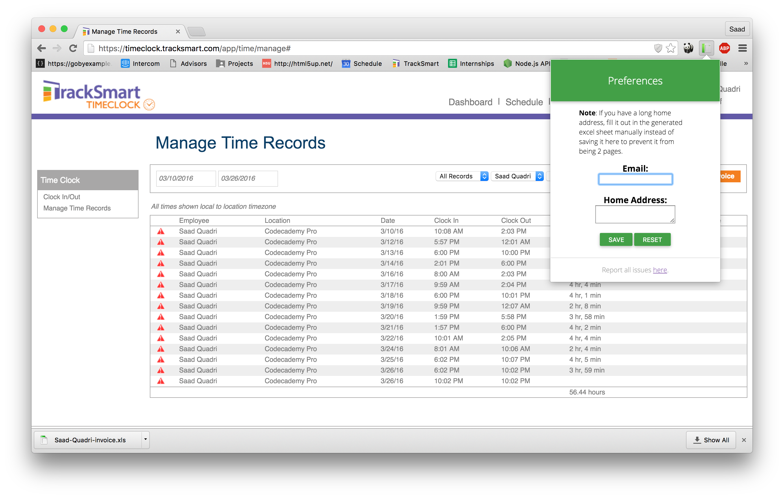
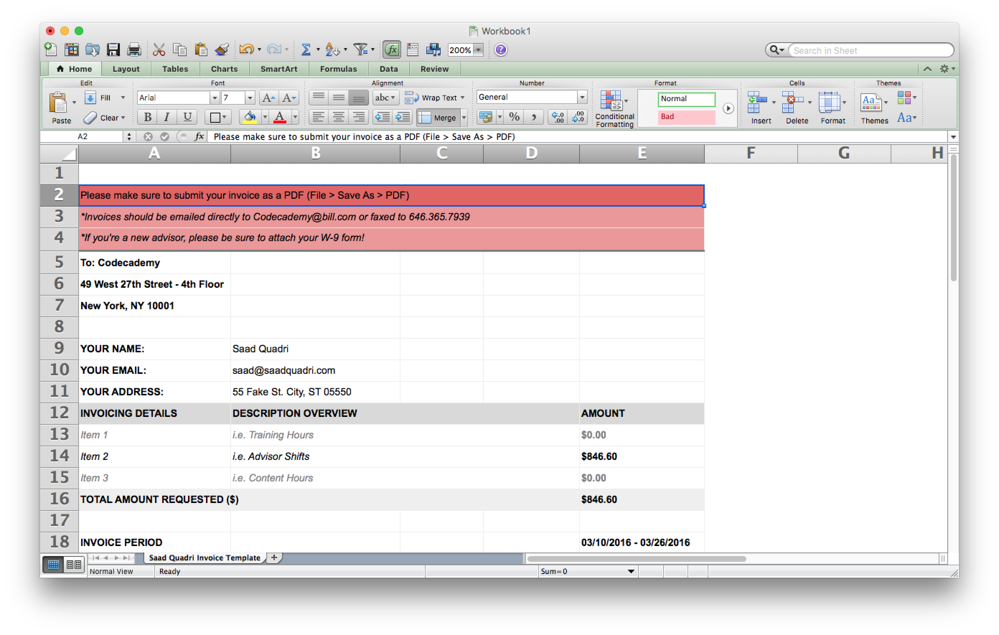

# cc-invoice
> A chrome extension that automatically generates an invoice for Codecademy Advisors.

## Usage
1. Install the chrome extension [here](https://chrome.google.com/webstore/detail/codecademy-invoice-genera/mkbpkhombfeimdgbnebamganohlgpcbi).
2. Set your preferences by clicking on the popup icon at the top (optional).
3. Head over to [Time Clock](https://timeclock.tracksmart.com/app/time/manage) and choose your start and end dates for the invoice. Press <kbd>Get Records</kbd>.
4. Press <kbd>Generate Invoice</kbd> and an `.xls` file will download. Open up that file, and give it a look through to make sure everything looks good.
5. Do **File > Save as PDF** and then you'll be able to send the PDF output to Codecademy.
